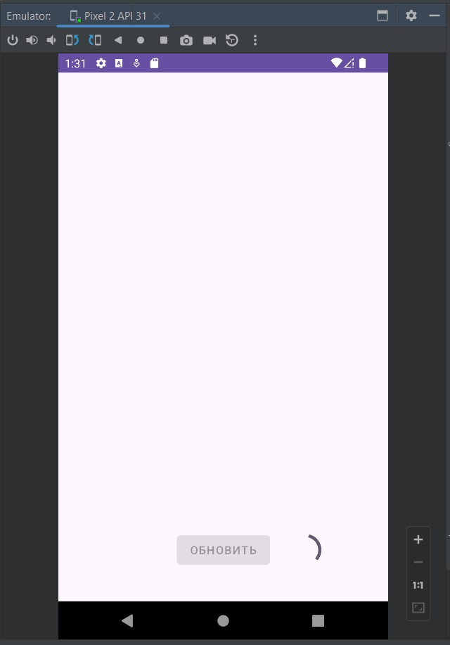
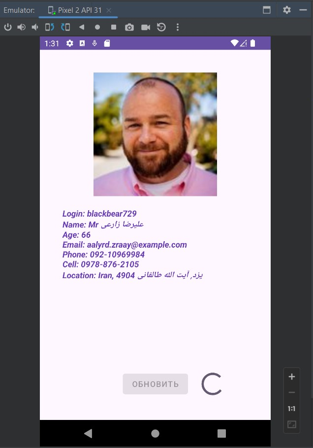
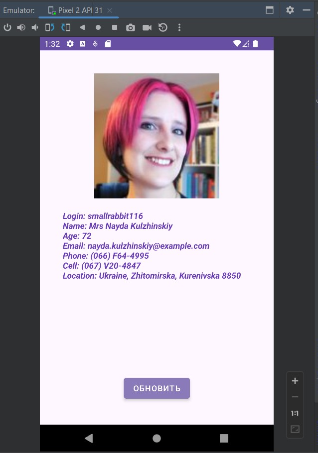

# Урок 14. Работа с сетью

### Цели практической работы:
- Применить знания по работе с сетью в Android.
- Поработать с REST API, используя библиотеку Retrofit.

### Что нужно сделать:
Cоздать приложение для загрузки и отображения данных о пользователе. 
В интерфейсе также должна быть предусмотрена кнопка «Обновить», которая загрузит 
новые данные случайного пользователя и отобразит их на экране.

1. Создайте приложение и проинициализируйте в нём библиотеку Retrofit.
2. Попробуйте выполнить запрос https://randomuser.me/api/ в браузере и 
   определите поля, которые приходят в ответ.
3. Опишите модель данных пользователя согласно данным из запроса.
4. Создайте запрос загрузки данных случайного пользователя для Retrofit.
5. Сверстайте экран с необходимыми полями.
6. Добавьте первичную инициализацию экрана — при запуске приложения пользователь должен сразу видеть 
   результат работы программы.
7. Добавьте кнопку «Перезагрузить», при нажатии на которую приложение обновляет данные на экране.
8. Добавьте библиотеку Glide для загрузки изображений. Для этого вам необходимо познакомиться 
   с инструкциями по подключению и использованию.

=====================================================================================================

## Демонстрация решения:

